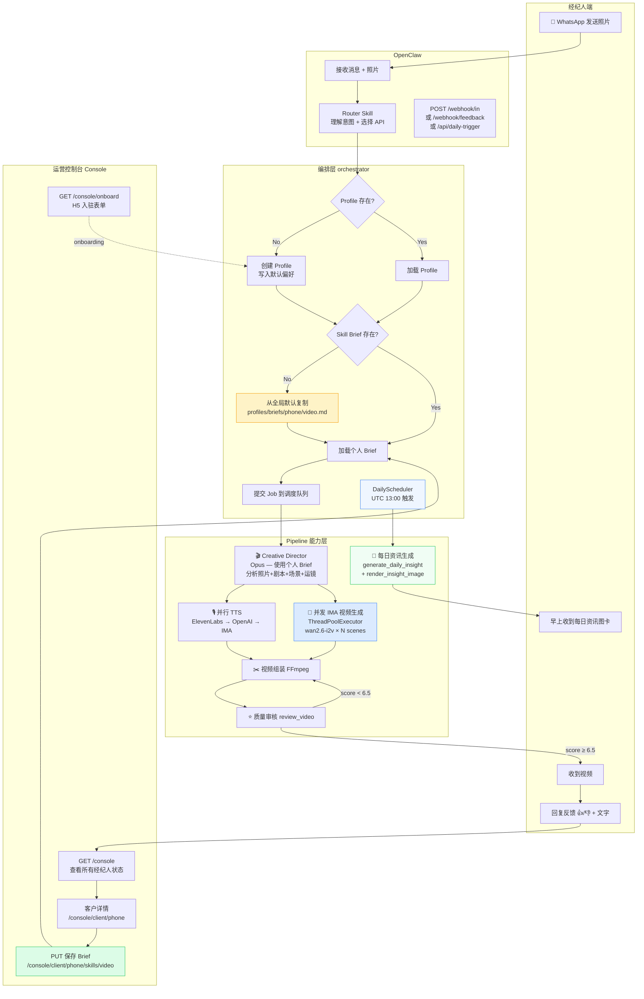
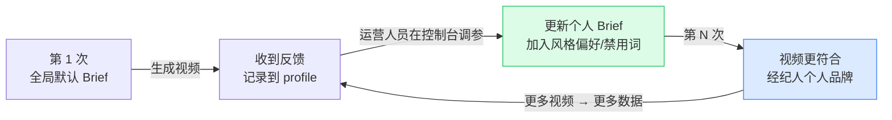

# Reel Agent — 产品需求文档（PRD）

> 版本：2.0 Alpha
> 最后更新：2026-04-01
> 维护者：Product Team
> 状态：Alpha 开发中

---

## 目录

1. [产品概述](#1-产品概述)
2. [目标用户](#2-目标用户)
3. [核心体验路径](#3-核心体验路径)
4. [系统流程图](#4-系统流程图)
5. [模块功能清单](#5-模块功能清单)
6. [分工边界](#6-分工边界)
7. [成功指标](#7-成功指标)
8. [版本路线图](#8-版本路线图)
9. [非目标（明确不做）](#9-非目标明确不做)

---

## 1. 产品概述

### 一句话定位

**Reel Agent = 房产经纪人的社交媒体助手。**

不是"视频工具"，是"每天帮你维护社交媒体的助手"。经纪人只需要审批和发布，不需要创作。

### 核心价值主张

| 用户问题         | Reel Agent 的解法                        |
| ---------------- | ---------------------------------------- |
| 没时间做内容     | 发照片 → 收视频，3 分钟内完成            |
| 每次从零建立风格 | 偏好记忆，用过 3 次后首版通过率 ≥ 80%    |
| 视频质量不稳定   | 剧本打分 + 视频自动质检双重保障          |
| 内容更新频率太低 | 每日市场资讯，每天早上推送可直接发布内容 |
| 不知道从哪里开始 | 加好友即用，WhatsApp 是已知渠道，零门槛  |

### 产品形态

- **入口**：WhatsApp（目标用户最熟悉的渠道）
- **交互方式**：消息 + 按钮 + 列表（OpenClaw 原生组件）
- **后台**：运营控制台（Web 端，运营人员使用）

---

## 2. 目标用户

### 核心用户：关系驱动型经纪人

靠 referral 和口碑成交，每年 10-25+ 单。知道社交媒体重要，但永远被带看、谈判、文书工作打断，没时间做内容。

**典型画像：Prita**

- 10 年资深经纪人，100% referral 业务
- 有活跃交易，完全没时间研究内容工具
- 第一次用时连 @机器人都不会，但看到视频后立刻提修改意见
- 问她"要不要出镜拍更精致的视频"，她选"不用，直接帮我生成就好"

### 非目标用户

- **Josh 类型**（29 岁，Instagram 原生用户）：自己能做内容，需要的是 CRM，不是内容工具

### 核心洞察

> 问题不是"不会做内容"，而是"没有启动的契机"。
> 我们要解决的是 **activation**，不是 creation。

---

## 3. 核心体验路径

### 路径 A：新 Listing 视频（核心场景）

```
经纪人（下午）
│
├── 发 8 张照片到 WhatsApp
│
├── Bot 自动识别是房源照片（无需 @）
│
├── ── 有偏好记忆 ──────────────────────────────────
│   └── Bot："用你上次的优雅风格？" → 直接生成
│
├── ── 无偏好记忆 ──────────────────────────────────
│   ├── Bot 发按钮："选个风格？" [活力] [优雅] [专业]
│   ├── 经纪人点 [优雅]
│   └── Bot 确认开始
│
├── ~3 分钟后：收到视频 + 文案 + Hashtag
│
├── 经纪人："背景音乐换活泼点"
│   └── Bot 只重做音乐，2 分钟后收到新版
│
└── 经纪人点 [满意] → 复制文案发 Instagram
```

### 路径 B：每日市场资讯（高频场景）

```
早上 8:00（UTC 13:00 触发）
│
├── Bot 自动抓取利率 + 当地 Redfin 市场数据
├── Claude 生成品牌化图文内容包
├── Pillow 渲染品牌图卡（含头像/tagline/配色）
│
└── 经纪人收到图卡 + 文案 + Hashtag
    ├── 点 [发布] → 直接复制发 Instagram
    └── 点 [跳过] → 明天再推
```

### 路径 C：运营 Onboarding（工作流）

```
运营人员（/console）
│
├── 创建新客户（输入姓名 + 电话）
├── 生成 H5 入驻表单链接
├── Bot 自动发送链接到经纪人 WhatsApp
│
└── 经纪人填写偏好（3 分钟）
    ├── 市场区域（Lehigh Valley / Austin...）
    ├── 视频风格（优雅 / 专业 / 活力）
    ├── 平台（Instagram / Facebook / TikTok）
    └── 语言（中文 / English）

运营人员可在 /console/client/{phone} 查看 & 编辑
所有 23 个字段，并在线调整 Skill Brief
```

---

## 4. 系统流程图

### 4.1 完整业务流程



### 4.2 Skill 飞轮（核心资产增长逻辑）



### 4.3 版本演进 Diff（1.x → 2.0）

| 维度         | 1.x（旧）                        | 2.0（新）                                                          |
| ------------ | -------------------------------- | ------------------------------------------------------------------ |
| 创意简报     | 所有经纪人共用一份全局模板       | 每人一个 `profiles/briefs/{phone}/video.md`，运营控制台可查看/编辑 |
| 视频生成并发 | 串行 for 循环，scene1→scene2→... | `ThreadPoolExecutor`，所有 scene 同时提交 IMA，等最慢那个          |
| 视频模型     | `kling-v2-6`                     | `wan2.6-i2v`（更快 ~90s/clip）                                     |
| TTS 主路径   | IMA TTS 任务队列（慢）           | ElevenLabs（秒级）→ OpenAI → IMA 兜底                              |
| 反馈闭环     | 无                               | 反馈记录到 `profile.revision_history`，运营控制台据此更新 Brief    |
| 运营后台     | 无                               | `/console`：列表 + 客户详情 + Brief 编辑器 + H5 入驻表单           |
| 每日内容     | 无                               | 每日 UTC 13:00 自动推送市场资讯图卡                                |

### 4.4 Skill 文件结构

```
skills/listing-video/
├── prompts/
│   └── creative_director.md        ← 全局默认（只读，所有人的起点）
└── profiles/
    ├── +60175029017.json            ← 经纪人基础信息 + 反馈历史
    └── briefs/
        ├── 60175029017/
        │   └── video.md             ← 个人 Skill Brief（可定制）
        └── ...                      ← 未来扩展：poster.md, news.md...
```

---

## 5. 模块功能清单

### 5.1 视频生成管线（Pipeline）

**触发**：经纪人发照片 → OpenClaw → POST /webhook/in

| 步骤       | 模块                  | 说明                                         |
| ---------- | --------------------- | -------------------------------------------- |
| 1          | `creative_director`   | 分析照片、加载个人 Skill Brief，输出视频方案 |
| 2          | `analyze_photos`      | Claude Vision 逐张分析（房间类型/质量/卖点） |
| 3          | `plan_scenes`         | 叙事弧规划（Hook-First，6 镜头结构）         |
| 4          | `generate_script`     | hook + walk-through + closer 配音文案        |
| 5          | `write_video_prompts` | 每镜头运镜 prompt（dolly/pan/orbit/zoom）    |
| 6          | `render_ai_video`     | IMA Studio（WAN 2.6）并发生成所有镜头        |
| 6-fallback | `render_slideshow`    | IMA 失败时降级为 Ken Burns 幻灯片            |
| 7          | `generate_voice`      | TTS：ElevenLabs → OpenAI → IMA 三级 fallback |
| 8          | `assemble_final`      | FFmpeg 组装（clip + voice + BGM + 字幕叠层） |
| 9          | `review_video`        | 质量评审：综合打分 + motion metrics          |
| 10         | `video_diagnostics`   | 自动生成 diagnostics.json（L1-L5 五层归因）  |

**AI 视频红线**（不可跨越）：

- 禁止添加照片中没有的物体（家具/人/车）
- 禁止改变天气/季节/时间
- 禁止虚拟 staging
- 只允许：运镜、光影微变、自然摆动、景深变化

### 5.2 每日资讯管线（Daily Content）

**触发**：每日 UTC 13:00（北美东部时间 8:00 AM）自动执行

| 步骤 | 模块                     | 说明                                            |
| ---- | ------------------------ | ----------------------------------------------- |
| 1    | `market_data_fetcher`    | 抓取实时利率数据（全局，所有经纪人共享）        |
| 2    | `redfin_data_fetcher`    | 抓取各市场区域 Redfin 数据（按市场去重）        |
| 3    | `generate_daily_insight` | Claude 生成内容包（标题/正文/图片数据/Hashtag） |
| 4    | `render_insight_image`   | Pillow 渲染品牌图卡（支持多格式/多平台）        |
| 5    | `progress_notifier`      | 推送图卡 + 文案到经纪人 WhatsApp                |

**经纪人控制**：

- `daily_push_enabled`：订阅/取消每日推送
- 文字指令：`stop push` / `resume push`

### 5.3 消息路由（Intent Routing）

**生产入口**：OpenClaw Router Skill 直接理解用户消息，再调用纯流水线 API。

| 用户意图            | OpenClaw 动作                 | 后端职责                      |
| ------------------- | ----------------------------- | ----------------------------- |
| 发照片做视频        | 调 `POST /webhook/in`         | 创建 job，进入视频 pipeline   |
| 交付后要求修改      | 调 `POST /webhook/feedback`   | 分类反馈并最小化重做          |
| 想要 daily insight  | 调 `POST /api/daily-trigger`  | 触发 daily insight pipeline   |
| 想查偏好/是否有风格 | 调 `GET /api/profile/{phone}` | 返回 profile / readiness 信息 |

> **[D9]** `POST /api/message` 和 `POST /api/router-test` 仅保留为测试入口，用于本地 dialogue eval、回归测试和 prelaunch audit，不承接生产流量。

### 5.4 偏好记忆系统（Profile + Skill Brief）

**两层记忆结构**：

```
profile.json（基础信息 + 偏好 + 反馈历史）
  ├── identity：姓名、电话、城市
  ├── preferences：风格、语言、音乐
  ├── content_preferences：市场区域、推送开关、配色
  ├── business：客户群体、专注地产类型
  ├── brand：tagline、头像路径
  ├── stats：视频数量、修改轮次
  └── revision_history：所有反馈记录

profiles/briefs/{phone}/video.md（Skill Brief）
  └── 个性化创意简报：风格偏好/禁用词/市场知识
      ← 新用户复制全局默认，运营可在线调整
```

**飞轮逻辑**：

```
第 1 次（全局默认 Brief）
  → 交付视频
  → 收到反馈（feedback_classifier 分类）
  → 运营在控制台调整 Skill Brief
  → 第 N 次视频更符合个人品牌
  → 修改轮数减少，首版通过率提升
```

### 5.5 运营控制台（/console）

**面向对象**：运营人员（非经纪人）

| 页面        | URL                       | 功能                                              |
| ----------- | ------------------------- | ------------------------------------------------- |
| 仪表板      | `/console/`               | 所有经纪人列表，含 profile 完整度进度条           |
| 新建客户    | `/console/onboard`        | 填写姓名+电话 → 生成 H5 链接 → Bot 自动发送       |
| H5 入驻表单 | `/console/form/{token}`   | 经纪人自助填写偏好，提交后 Bot 通知运营           |
| 客户详情    | `/console/client/{phone}` | 23-field 完整视图 + 在线编辑 + Skill Brief 编辑器 |

### 5.6 编排层（Orchestrator）

**状态机**（不可跳步）：

```
QUEUED → ANALYZING → SCRIPTING → PROMPTING → PRODUCING → ASSEMBLING → DELIVERED
                                                                       ↓
                                                               FAILED | CANCELLED
```

**后台守护任务**：

| 任务                   | 频率           | 功能                             |
| ---------------------- | -------------- | -------------------------------- |
| `DailyScheduler`       | 每日 UTC 13:00 | 每日资讯全量推送                 |
| `_job_watchdog_loop`   | 每 60s         | 检测 stall > 10min 的 job 并告警 |
| `_callback_retry_loop` | 每 30s         | 刷新失败回调队列                 |

**Quality Gates**（5 关卡）：

- `critical`：触发中止，不重试
- `warning`：记录日志，继续执行

---

## 6. 分工边界

### OpenClaw vs Pipeline

| | OpenClaw（对话层 + 路由层） | Pipeline（生产层） |
|--|----|----||
| 负责 | 跟经纪人沟通、理解意图、路由到正确 API | 生成视频/资讯/图卡 |
| 类比 | 餐厅前台：理解需求，通知后厨做什么菜 | 后厨：看食材、定做法、出菜 |
| 意图识别 | OpenClaw Router Skill（LLM，理解自然语言） | 不做意图识别 |

**生产态 4 个核心 webhook（OpenClaw 直接调用）：**

| OpenClaw 判断           | 调用                       |
| ----------------------- | -------------------------- |
| 用户发照片 + 确认风格   | `POST /webhook/in`         |
| 用户对视频提修改意见    | `POST /webhook/feedback`   |
| 查询经纪人已有偏好      | `GET /api/profile/{phone}` |
| 每日资讯（定时 / 手动） | `POST /api/daily-trigger`  |

> **[D9]** `/api/message` 保留为测试入口（无 OpenClaw 连接时模拟完整路由），生产流量不走此路径。

### 经纪人 vs 系统 vs 运营

| 系统自动做                 | 经纪人做          | 运营做             |
| -------------------------- | ----------------- | ------------------ |
| 分析照片、写剧本、生成视频 | 审批/拒绝最终成品 | 处理系统标记的异常 |
| 每日资讯生成 + 推送        | 选择发布或跳过    | 监控质检模型准确率 |
| 学习偏好                   | 提修改意见        | 新用户 onboarding  |
| 质量检查                   | 发内容到社交媒体  | 调整 Skill Brief   |

---

## 7. 成功指标

### Alpha 阶段（当前）：视频质量

| 指标         | 目标            | 1.0 基线 | 说明                             |
| ------------ | --------------- | -------- | -------------------------------- |
| 首版通过率   | ≥ 60%           | ~25%     | 用户收到视频后选"直接发布"的比例 |
| 平均修改轮数 | ≤ 2 轮          | 3-4 轮   | 每个 job 的 revision 次数        |
| 偏好命中率   | 第 3 次起 ≥ 80% | 0%       | 首版无风格相关修改的比例         |
| 出片时间     | < 5 分钟        | ~8 分钟  | 从收到照片到发出视频             |
| 单条成本     | ≤ $3.00         | ~$2.65   | API 调用总成本（含质检）         |

### Alpha+ 阶段：每日资讯

| 指标       | 目标      | 说明                          |
| ---------- | --------- | ----------------------------- |
| 每日推送率 | 100%      | 每个活跃经纪人每天都收到 1 条 |
| 发布率     | ≥ 40%     | 推了 10 条，至少发 4 条       |
| 周触达频率 | ≥ 5 天/周 | 经纪人与系统有交互的天数      |
| 单条成本   | ≤ $0.10   | 利率抓取 + Claude + Pillow    |

### 整体

| 指标       | 目标      |
| ---------- | --------- |
| 周活跃留存 | 连续 4 周 |

---

## 8. 版本路线图

### 当前：2.0 Alpha（开发中）

**已完成：**

- ✅ 视频生成全管线（10 步，含 AI 视频 + TTS + FFmpeg 组装）
- ✅ 每日资讯管线（利率 + Redfin + Claude + Pillow 图卡）
- ✅ 偏好记忆系统（profile.json + Skill Brief 双层）
- ✅ 运营控制台（仪表板 + onboarding + H5 表单 + 客户详情）
- ✅ 意图分类消息路由（10 种 intent）
- ✅ Quality Gates 五关卡 + diagnostics 五层归因
- ✅ Motion metrics 视频质量评分（OpenCV Farneback）

**待完成（P4-P6）：**

- [ ] Claude Files API / Structured Outputs / prompt caching SDK 改造
- [ ] OpenClaw 入站 webhook 完整实现
- [ ] BGM 素材 + 字体资源
- [ ] API 集成测试（真实 IMA Studio + TTS）

### 2.0 Alpha+（第 3-4 周）

- 每日资讯多格式多平台（IG Story / Feed / Facebook）

### 2.0 Beta-1（第 5-6 周）

- 剧本自动打分 + 视频自动质检（准确率监控）

### 2.0 Beta-2（第 7-8 周）

- 模型适配层标准化 + 渠道抽象（接入 Telegram / iMessage）

### 2.1（第 9-12 周）

- Just Sold 内容类型
- MLS 自动发现新房源（需一次 MLS 授权）

### 2.2（第 13-16 周）

- Brand Story 内容类型
- 一键多平台发布（需 OAuth 授权）

### 3.0（未来）

- CRM 集成 + ROI 追踪 + 全自动发布

---

## 9. 非目标（明确不做）

| 不做什么            | 原因                                        |
| ------------------- | ------------------------------------------- |
| Web App 前端        | 目标用户不学新工具，WhatsApp 是唯一正确入口 |
| 经纪人出镜拍摄      | 用户访谈结论：她们选"直接帮我生成"          |
| 多 Agent 串行架构   | 增加延迟和成本，经纪人不需要 5 个 agent     |
| 虚拟 staging        | AI 生成不存在物体，损害内容可信度           |
| 实时一键发布（2.0） | OAuth 授权门槛，延至 2.2 验证价值后再做     |
| 本地部署（2.0）     | 终局形态，当经纪人主动要求时（3.0+）再做    |

---

## 附录：API 端点速查

| 方法   | 路径                      | 说明                          | 权限         |
| ------ | ------------------------- | ----------------------------- | ------------ |
| `GET`  | `/`                       | 测试 UI                       | 开放         |
| `GET`  | `/health`                 | 健康检查                      | 开放         |
| `POST` | `/api/generate`           | 上传照片，创建视频 job        | Bearer token |
| `GET`  | `/api/status/{job_id}`    | 查询 job 状态 + 视频 URL      | 开放         |
| `POST` | `/api/message`            | 测试入口：本地消息路由桩      | Bearer token |
| `POST` | `/api/router-test`        | 测试入口别名：路由调试        | Bearer token |
| `GET`  | `/api/profile/{phone}`    | 查询经纪人偏好                | 开放         |
| `POST` | `/api/daily-trigger`      | 手动触发每日资讯              | Bearer token |
| `POST` | `/webhook/in`             | OpenClaw 入站（视频需求确认） | Bearer token |
| `POST` | `/webhook/feedback`       | 交付后反馈，触发最小化重做    | Bearer token |
| `GET`  | `/console/`               | 运营仪表板                    | 开放（开发） |
| `GET`  | `/console/onboard`        | 新建客户 + H5 链接            | 开放（开发） |
| `GET`  | `/console/form/{token}`   | 经纪人入驻表单                | 开放         |
| `GET`  | `/console/client/{phone}` | 客户详情 + Brief 编辑         | 开放（开发） |

---

> **文档维护说明**
>
> 本文档由产品团队维护，流程图已内嵌（第 4 节）。技术实现细节请查阅：
>
> - `CLAUDE.md` — 架构约束、代码规范、文件结构（开发用）
> - `DECISIONS.md` — 关键架构决策记录（开发用）
> - `STATUS.md` — 当前开发状态
