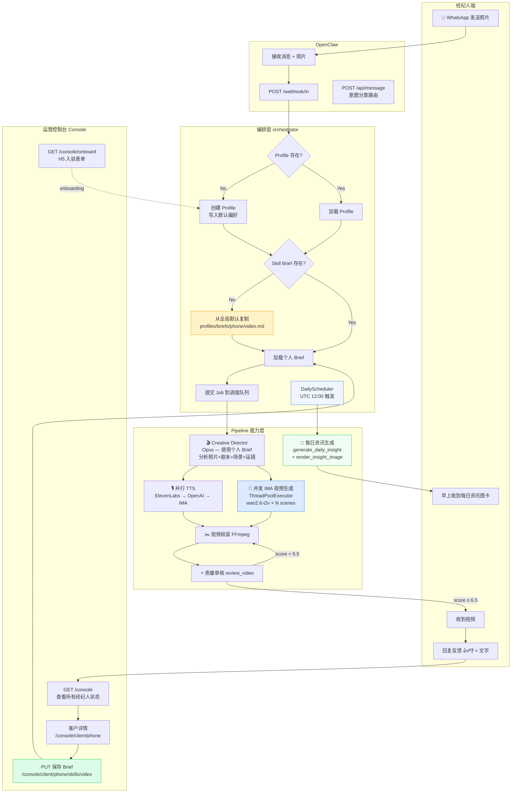
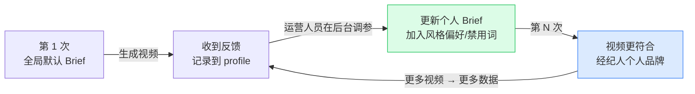

# Skill 系统设计文档

> 核心理念：平台最终沉淀的资产，是每一个经纪人的 Skill — 个人创意简报 + 偏好 + 反馈历史的累积。

---

## 图一：完整业务流程



---

## 图二：Skill 飞轮（核心资产增长逻辑）



---

## 图三：版本 Diff（1.x → 2.0）

| 维度         | 1.x（旧）                                 | 2.0（新）                                                        |
| ------------ | ----------------------------------------- | ---------------------------------------------------------------- |
| 创意简报     | 所有经纪人共用一份 `creative_director.md` | 每人一个 `profiles/briefs/{phone}/video.md`，运营后台可查看/编辑 |
| 视频生成并发 | 串行 for 循环，scene1→scene2→...          | `ThreadPoolExecutor`，所有 scene 同时提交 IMA，等最慢那个        |
| 视频模型     | `kling-v2-6`（贵、慢、时长限制）          | `wan2.6-i2v`（更快 ~90s/clip，无时长限制）                       |
| TTS 主路径   | IMA TTS（需任务队列，慢）                 | ElevenLabs（单次 HTTP 秒级）→ OpenAI → IMA 兜底                  |
| 反馈闭环     | 无                                        | 反馈记录到 `profile.revision_history`，运营后台可据此更新 Brief  |
| 运营后台     | 无                                        | `/admin` 页面：列表 + 浏览器内 Markdown 编辑器                   |

---

## 图四：Skill 文件结构

```
skills/listing-video/
├── prompts/
│   └── creative_director.md        ← 全局默认（只读，所有人的起点）
└── profiles/
    ├── +60175029017.json            ← 经纪人基础信息 + 反馈历史
    └── briefs/
        ├── 60175029017/
        │   └── video.md             ← Neo 的个人 Skill Brief（可定制）
        ├── 1234567890/
        │   └── video.md             ← Agent B 的个人 Skill Brief
        └── ...
            └── video.md             ← 未来扩展：poster.md, news.md...
```

---

## 运营控制台使用方式

服务启动后，访问 `http://localhost:8000/console`：

| 页面        | URL                                                | 功能                                    |
| ----------- | -------------------------------------------------- | --------------------------------------- |
| 仪表板      | `/console/`                                        | 查看所有经纪人，显示 Brief 是否已定制   |
| 创建客户    | `/console/onboard`                                 | 创建新经纪人 profile + 生成 H5 表单链接 |
| H5 入驻表单 | `/console/form/{token}`                            | 经纪人填写偏好（风格/市场/语言等）      |
| 客户详情    | `/console/client/{phone}`                          | 23-field 详情 + Skill Brief 在线编辑    |
| 保存 Brief  | `PUT /console/client/{phone}/skills/{type}`        | 保存视频或资讯 Skill Brief              |
| 重置 Brief  | `POST /console/client/{phone}/skills/{type}/reset` | 恢复为全局默认                          |
| 字段编辑    | `POST /console/api/update-field`                   | HTMX 内联编辑任意字段（无 reload）      |

---

## 关键设计决策

| 决策点                    | 选择           | 原因                                                      |
| ------------------------- | -------------- | --------------------------------------------------------- |
| Brief 存哪里              | 文件系统 `.md` | 运营人员可直接用编辑器改，无需数据库                      |
| `profile.json` 加不加字段 | 不加           | 路径由 phone 派生，无需显式存储                           |
| 全局 default 改不改       | 不改           | 全局 default 是新经纪人的起点，永远有效                   |
| 反馈 → 自动更新 Brief     | 本期不做       | 先人工调参验证价值，再自动化                              |
| 多 Skill 支持             | 目录结构已预留 | `video.md` 命名，未来加 `poster.md`、`news.md` 零成本扩展 |
